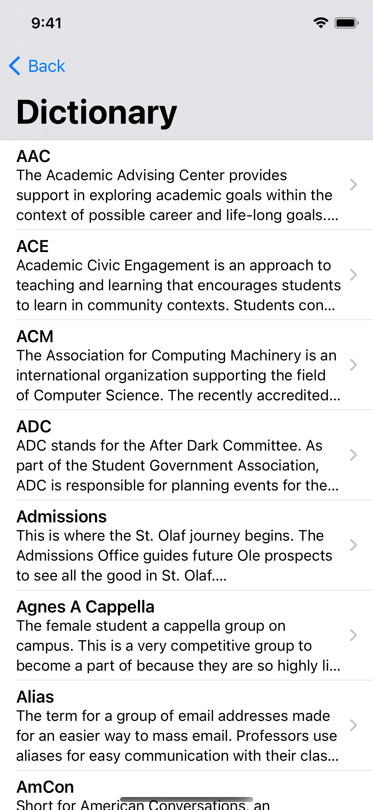

# All About Olaf X

## About

SwiftUI and Combine implementation of All About Olaf.

* [v1: (Deprecated) Objective-C]
* [v2: (Active) React Native]
* [v3: (Future) SwiftUI]

[v1: (Deprecated) Objective-C]: https://github.com/StoDevX/old-all-about-olaf
[v2: (Active) React Native]: https://github.com/StoDevX/AAO-React-Native
[v3: (Future) SwiftUI]: https://github.com/drewvolz/AllAboutOlaf-X

## Screenshots

2019 –– October

~ | ~ | ~
--|--|--
 |  | 
 |  | 

## Contributing

Thank you for your interest in contributing to All About Olaf X. Contributions are welcome in the form of issues and pull requests.
